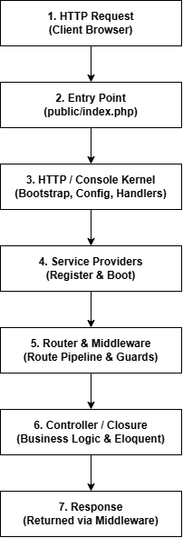
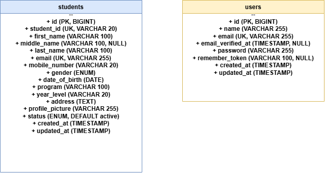
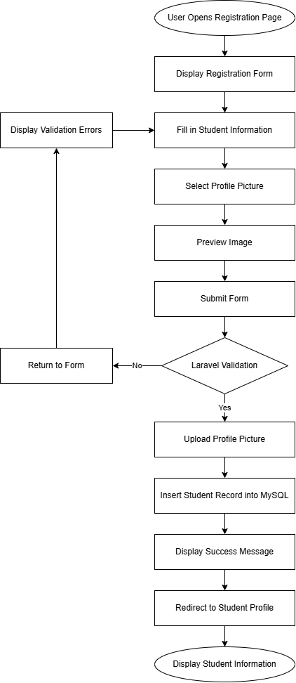

# Student Registration System

## ITST 302 – Client-Server Technologies

### Week 4 / Mini Project 03

**Student Name:** Ernest James R. De Leon  
**Year & Section:** BSIT 3rd Year

---

## 1. Project Title

**Student Registration System with Laravel Forms, Server-Side Validation, and File Storage**

---

## 2. Introduction

### Purpose of a Student Registration System

A Student Registration System is a web application used to collect and manage student information. Instead of keeping student information only on paper, the system allows users to enter and save important details such as Student ID, name, email, mobile number, date of birth, gender, address, program, year level, and profile picture.

For this project, Laravel is used to handle the backend while MySQL is used for storing the student records. The system also allows the uploaded profile picture to be stored on the server and displayed on the student's profile page.

### Importance of Data Validation

Data validation is important because users do not always enter information in the correct format. For example, a user might leave a required field empty, enter an invalid email address, use letters in a phone number, or upload a file that is not actually an image.

The project uses Laravel's server-side validation to check the submitted information before saving it to the database. This is important because browser-side validation alone is not enough. A user can disable JavaScript or submit requests using another tool, so the server still needs to check the data.

The system also checks uploaded profile pictures and only allows JPG, JPEG, and PNG files with a maximum size of 2MB. This helps prevent unnecessary files and potentially harmful uploads from being stored on the server.

### Role of Registration Systems in Enterprise Applications

Registration is commonly one of the first parts of a larger information system. Once a student's information is registered, other systems can use the same information for different purposes.

For example, a school may use student records for enrollment, grades, attendance, billing, and other academic services. Because of this, incorrect information at the registration stage can cause problems in other parts of the system.

---

## 3. Objectives

The objectives of this laboratory activity are:

- Create a responsive student registration form using Laravel Blade.
- Use Laravel's `@csrf` protection and `multipart/form-data` for form submissions.
- Implement server-side validation using `StoreStudentRequest` and `UpdateStudentRequest`.
- Validate student information before saving it to MySQL.
- Allow users to upload JPG, JPEG, and PNG profile pictures up to 2MB.
- Store uploaded images using Laravel Storage.
- Create the public storage link using `php artisan storage:link`.
- Create a relational MySQL `students` table with appropriate data types and constraints.
- Display validation errors and session flash messages.
- Display a student's saved information and profile picture.
- Add student management features such as searching, filtering, editing, and printing student records.

---

## 4. Laravel Request Lifecycle

When a user registers a student, the request passes through several parts of the Laravel application.

The general process is:



### Step-by-Step Process

**1. Browser**

The user opens `/students/create`, fills out the registration form, chooses a profile picture, and submits the form.

The form sends a `POST` request containing the student information and uploaded image.

**2. Route**

The route in `routes/web.php` receives the request and sends it to the appropriate method in `StudentController`.

**3. Validation**

Laravel resolves the `StoreStudentRequest` before the controller processes the information. The request checks required fields, email format, unique values, date of birth, year level, and profile picture restrictions.

If the information is invalid, Laravel redirects the user back to the form and displays the validation errors.

**4. Controller**

If validation succeeds, `StudentController@store()` receives the validated information.

**5. Storage**

The uploaded profile picture is saved to:

```text
storage/app/public/profile_pictures
```

Laravel returns the path of the uploaded file.

**6. Model**

The `Student` Eloquent model is used to prepare the validated information for database insertion.

**7. Database**

Eloquent sends the information to the MySQL `students` table using an SQL `INSERT` operation.

**8. Response**

After the record is successfully saved, Laravel creates a success flash message and redirects the user to the student's profile page.

---

## 5. Validation Rules

The system uses server-side validation to make sure that the information submitted by the user is acceptable.

| Field             | Validation Rule                                              | Purpose                                                |
| ----------------- | ------------------------------------------------------------ | ------------------------------------------------------ |
| `student_id`      | `required`, `string`, `max:20`, `unique:students,student_id` | Makes sure every student has a unique Student ID.      |
| `first_name`      | `required`, `string`, `max:100`                              | Makes the student's first name required.               |
| `middle_name`     | `nullable`, `string`, `max:100`                              | Allows the middle name to be left blank.               |
| `last_name`       | `required`, `string`, `max:100`                              | Requires the student's surname.                        |
| `email`           | `required`, `email`, `max:255`, `unique:students,email`      | Checks the email format and prevents duplicate emails. |
| `mobile_number`   | `required`, `string`, `regex:/^[0-9+\-\s()]{7,20}$/`         | Prevents invalid characters in the contact number.     |
| `gender`          | `required`, `in:Male,Female,Other`                           | Limits the available gender choices.                   |
| `date_of_birth`   | `required`, `date`, `before:today`, `after:1900-01-01`       | Makes sure the date is valid and is in the past.       |
| `program`         | `required`, `string`, `max:100`                              | Requires the student's academic program.               |
| `year_level`      | `required`, `in:1st Year,2nd Year,3rd Year,4th Year`         | Limits the year level to the available choices.        |
| `address`         | `required`, `string`, `max:500`                              | Requires the student's home address.                   |
| `profile_picture` | `required`, `image`, `mimes:jpg,jpeg,png`, `max:2048`        | Allows only supported image formats up to 2MB.         |

The validation rules are handled by Laravel before the information reaches the controller and database. This prevents invalid information from being stored.

---

## 6. Database Design

### Entity Relationship Diagram

The main table used by the registration system is the `students` table.



The `id` column is the primary key and is automatically incremented. The `student_id` and `email` columns have unique constraints so that duplicate student records cannot use the same values.

---

## 7. Flowchart

The registration process follows this flow:



### Registration Process

1. The user opens the registration page.
2. The registration form is displayed.
3. The user enters personal, contact, and academic information.
4. The user selects a profile picture.
5. The image can be previewed before submitting.
6. The form is submitted.
7. Laravel validates the information.
8. If there are errors, the user is returned to the form with error messages.
9. If the information is valid, the image is uploaded.
10. The student record is inserted into MySQL.
11. A success message is displayed.
12. The user is redirected to the student's profile page.

---

## 8. Screenshots

The following screenshots should be included in the `screenshots/` folder.

### 1. Registration Form

`registration-form.png`

Shows the main student registration form, including the personal information fields and profile picture upload.

### 2. Validation Errors

`validation-errors.png`

Shows the validation messages displayed when incorrect or incomplete information is submitted.

### 3. Successful Registration, 4. Flash Message, 5. Uploaded Profile Picture, 7. Student Profile Page

`Flash-Success-Message.png`

Shows the success notification after a student has been successfully registered.

Shows the dismissible success message displayed after registration.

Shows the student's profile page with the uploaded image.

Shows the complete student profile and registered information.

### 6. Database Table

`database.png`

Shows the `students` table and the registered student information in MySQL or phpMyAdmin.

### 8. Laravel Project Structure

`laravel-structure.png`

Shows the Laravel project folders and files inside VS Code.

### 9. GitHub Repository

`github-repo.png`

Shows the project's GitHub repository, commits, and documentation.

### 10. Browser Output

`browser-output.png`

Shows the project's web output and homepage .

---

## 9. Problems Encountered

### 1. Profile Picture Was Not Displaying

One problem I encountered was that the profile picture was uploaded successfully but did not appear on the student's profile page. The image path was already saved in MySQL, but the browser could not access the file directly.

This happened because files inside `storage/app/public` are not automatically accessible through the browser.

### 2. MySQL Access Denied

Another problem occurred when running the Laravel migrations. Laravel returned an error similar to:

```text
SQLSTATE[HY000] [1045] Access denied for user 'root'@'localhost'
```

The problem was caused by the MySQL root account having a password while the Laravel `.env` file did not have the correct password.

### 3. Unique Validation During Editing

When editing an existing student, the Student ID and email were being reported as already taken even when the values had not been changed.

The validator was checking the current student's own record as if it belonged to another student.

---

## 10. Solutions

### 1. Fixing the Profile Picture

I used the Laravel storage link command:

```bash
php artisan storage:link
```

This creates a link between the public storage directory and the actual storage location.

The image can then be displayed in Blade using:

```php
asset('storage/' . $student->profile_picture)
```

### 2. Fixing the MySQL Connection

I checked the database credentials in the `.env` file and entered the correct MySQL password.

The database used for the project was:

```text
student_registration
```

After changing the configuration, I cleared Laravel's cached configuration:

```bash
php artisan config:clear
```

After that, the migration was able to connect to MySQL.

### 3. Fixing Unique Validation During Editing

A separate `UpdateStudentRequest` was created for editing records.

The unique rule uses Laravel's `ignore()` method so that the current student's own Student ID and email are not treated as duplicates.

For example:

```php
Rule::unique('students', 'student_id')->ignore($studentId)
```

This allows a student to keep the same Student ID while still preventing another student from using it.

---

## 11. Reflection

## Reflection

Working on the Student Registration System gave me a better idea of how Laravel works when building an actual web application. At first, I thought the project would mostly involve creating the registration form and saving the information to MySQL. While working on it, I realized that there are more steps involved, especially when it comes to validation, file uploads, and connecting the different parts of Laravel.

One of the things I learned from this project was the importance of server-side validation. At first, I mostly looked at validation as a way to make sure the user filled out the form correctly. However, I learned that frontend validation is not enough because users can still send incorrect data directly to the server. Using `StoreStudentRequest` made it easier to organize the validation rules instead of putting all of them inside the controller. I also became more familiar with rules like `required`, `unique`, `email`, `date`, and image validation.

I also learned that user input should always be checked before it is saved. For example, the Student ID and email should not be duplicated, and fields like gender and year level should only accept the values allowed by the system. These checks may seem small, but they can prevent problems with the database later on.

Another part of the project that I learned from was uploading the student's profile picture. I originally thought that the image could just be saved along with the other information in the database. Instead, I learned that Laravel can store the image in the storage folder and the database can just save the path of the image. This makes more sense because the database does not have to store the actual image file. I also learned why file type and file size restrictions are needed when allowing users to upload files.

I encountered some problems while working on the project. One of the problems was the uploaded profile picture not showing on the student profile page. The file was being uploaded, but the browser could not access it. After checking the problem, I found out that I needed to run `php artisan storage:link`. This was one of the issues that helped me understand Laravel's file storage better because I was able to see what was actually causing the problem instead of just copying a command without knowing its purpose.

I also had to deal with database connection problems and validation when editing student records. These problems were frustrating at first, but troubleshooting them helped me understand how the `.env` file, migrations, Form Requests, controllers, and database are connected.

Overall, this project helped me understand the basic flow of a Laravel client-server application. I learned that the process does not stop when the user clicks submit. The request goes through the route, validation, controller, model, and database before the result is returned to the user. As a third-year IT student, I think this experience is useful because these concepts can also be applied to bigger systems such as enrollment systems, school information systems, and other web applications. More importantly, I learned that solving errors and understanding why they happen is an important part of programming.

---

## 12. References

Laravel. (2026). _Laravel documentation: Validation and form requests_.  
https://laravel.com/docs/validation

Laravel. (2026). _Laravel documentation: File storage and public disks_.  
https://laravel.com/docs/filesystem

Laravel. (2026). _Laravel documentation: Eloquent ORM and database migrations_.  
https://laravel.com/docs/eloquent

MDN Web Docs. (2026). _Using files from web applications and FileReader API_. Mozilla.  
https://developer.mozilla.org/en-US/docs/Web/API/File_API/Using_files_from_web_applications

MySQL. (2026). _MySQL 8.0 reference manual: Data types and table constraints_. Oracle Corporation.  
https://dev.mysql.com/doc/refman/8.0/en/

PHP Documentation Group. (2026). _PHP manual: Handling file uploads and POST method uploads_. The PHP Group.  
https://www.php.net/manual/en/features.file-upload.post-method.php

Tailwind Labs. (2026). _Tailwind CSS documentation: Utility-first CSS framework_.  
https://tailwindcss.com/docs
