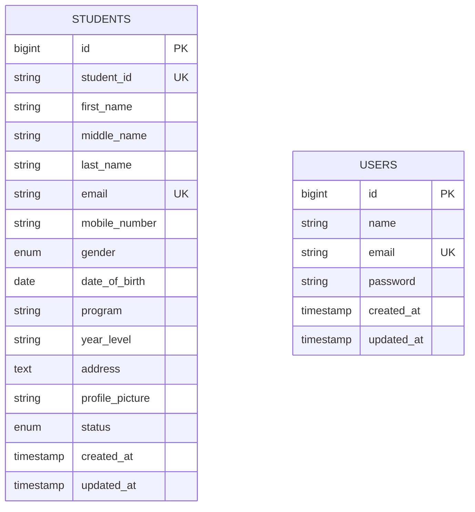
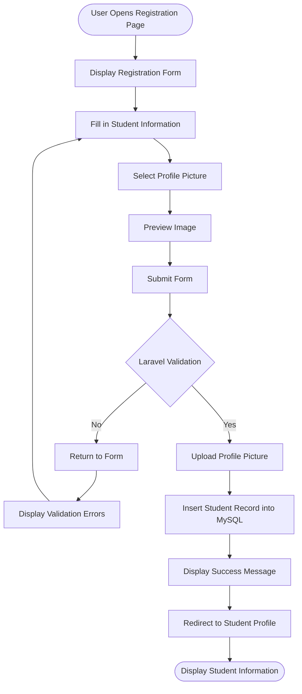

# Student Registration System

## ITST 302 – Client-Server Technologies
### Week 4 / Mini Project 03

**Student Name:** [Your Name]  
**Year & Section:** BSIT 3rd Year

---

## 1. Project Title

**Student Registration System with Laravel Forms, Server-Side Validation, and File Storage**

---

## 2. Introduction

### Purpose of a Student Registration System

A Student Registration System is a web application used to collect and manage student information. Instead of keeping student information only on paper, the system allows users to enter and save important details such as Student ID, name, email, mobile number, date of birth, gender, address, program, year level, and profile picture.

For this project, Laravel is used to handle the backend while MySQL is used for storing the student records. The system also allows the uploaded profile picture to be stored on the server and displayed on the student's profile page.

### Importance of Data Validation

Data validation is important because users do not always enter information in the correct format. For example, a user might leave a required field empty, enter an invalid email address, use letters in a phone number, or upload a file that is not actually an image.

The project uses Laravel's server-side validation to check the submitted information before saving it to the database. This is important because browser-side validation alone is not enough. A user can disable JavaScript or submit requests using another tool, so the server still needs to check the data.

The system also checks uploaded profile pictures and only allows JPG, JPEG, and PNG files with a maximum size of 2MB. This helps prevent unnecessary files and potentially harmful uploads from being stored on the server.

### Role of Registration Systems in Enterprise Applications

Registration is commonly one of the first parts of a larger information system. Once a student's information is registered, other systems can use the same information for different purposes.

For example, a school may use student records for enrollment, grades, attendance, billing, and other academic services. Because of this, incorrect information at the registration stage can cause problems in other parts of the system.

---

## 3. Objectives

The objectives of this laboratory activity are:

- Create a responsive student registration form using Laravel Blade.
- Use Laravel's `@csrf` protection and `multipart/form-data` for form submissions.
- Implement server-side validation using `StoreStudentRequest` and `UpdateStudentRequest`.
- Validate student information before saving it to MySQL.
- Allow users to upload JPG, JPEG, and PNG profile pictures up to 2MB.
- Store uploaded images using Laravel Storage.
- Create the public storage link using `php artisan storage:link`.
- Create a relational MySQL `students` table with appropriate data types and constraints.
- Display validation errors and session flash messages.
- Display a student's saved information and profile picture.
- Add student management features such as searching, filtering, editing, and printing student records.

---

## 4. Laravel Request Lifecycle

When a user registers a student, the request passes through several parts of the Laravel application.

The general process is:

```text
Browser
   ↓
Route
   ↓
Validation
   ↓
Controller
   ↓
Storage / Model
   ↓
MySQL Database
   ↓
Response / View
```

### Step-by-Step Process

**1. Browser**

The user opens `/students/create`, fills out the registration form, chooses a profile picture, and submits the form.

The form sends a `POST` request containing the student information and uploaded image.

**2. Route**

The route in `routes/web.php` receives the request and sends it to the appropriate method in `StudentController`.

**3. Validation**

Laravel resolves the `StoreStudentRequest` before the controller processes the information. The request checks required fields, email format, unique values, date of birth, year level, and profile picture restrictions.

If the information is invalid, Laravel redirects the user back to the form and displays the validation errors.

**4. Controller**

If validation succeeds, `StudentController@store()` receives the validated information.

**5. Storage**

The uploaded profile picture is saved to:

```text
storage/app/public/profile_pictures
```

Laravel returns the path of the uploaded file.

**6. Model**

The `Student` Eloquent model is used to prepare the validated information for database insertion.

**7. Database**

Eloquent sends the information to the MySQL `students` table using an SQL `INSERT` operation.

**8. Response**

After the record is successfully saved, Laravel creates a success flash message and redirects the user to the student's profile page.

---

## 5. Validation Rules

The system uses server-side validation to make sure that the information submitted by the user is acceptable.

| Field | Validation Rule | Purpose |
|---|---|---|
| `student_id` | `required`, `string`, `max:20`, `unique:students,student_id` | Makes sure every student has a unique Student ID. |
| `first_name` | `required`, `string`, `max:100` | Makes the student's first name required. |
| `middle_name` | `nullable`, `string`, `max:100` | Allows the middle name to be left blank. |
| `last_name` | `required`, `string`, `max:100` | Requires the student's surname. |
| `email` | `required`, `email`, `max:255`, `unique:students,email` | Checks the email format and prevents duplicate emails. |
| `mobile_number` | `required`, `string`, `regex:/^[0-9+\-\s()]{7,20}$/` | Prevents invalid characters in the contact number. |
| `gender` | `required`, `in:Male,Female,Other` | Limits the available gender choices. |
| `date_of_birth` | `required`, `date`, `before:today`, `after:1900-01-01` | Makes sure the date is valid and is in the past. |
| `program` | `required`, `string`, `max:100` | Requires the student's academic program. |
| `year_level` | `required`, `in:1st Year,2nd Year,3rd Year,4th Year` | Limits the year level to the available choices. |
| `address` | `required`, `string`, `max:500` | Requires the student's home address. |
| `profile_picture` | `required`, `image`, `mimes:jpg,jpeg,png`, `max:2048` | Allows only supported image formats up to 2MB. |

The validation rules are handled by Laravel before the information reaches the controller and database. This prevents invalid information from being stored.

---

## 6. Database Design

### Entity Relationship Diagram

The main table used by the registration system is the `students` table.



### Students Table Structure

| Column | Data Type | Key | Nullable | Description |
|---|---|---|---|---|
| `id` | BIGINT UNSIGNED | Primary Key | No | Unique record ID |
| `student_id` | VARCHAR(20) | Unique | No | School Student ID |
| `first_name` | VARCHAR(100) | — | No | Student first name |
| `middle_name` | VARCHAR(100) | — | Yes | Student middle name |
| `last_name` | VARCHAR(100) | — | No | Student surname |
| `email` | VARCHAR(255) | Unique | No | Student email |
| `mobile_number` | VARCHAR(20) | — | No | Contact number |
| `gender` | ENUM | — | No | Male, Female, or Other |
| `date_of_birth` | DATE | — | No | Student birth date |
| `program` | VARCHAR(100) | — | No | Degree program |
| `year_level` | VARCHAR(20) | — | No | Current year level |
| `address` | TEXT | — | No | Complete home address |
| `profile_picture` | VARCHAR(255) | — | No | Stored image path |
| `status` | ENUM | — | No | Active, inactive, or archived |
| `created_at` | TIMESTAMP | — | Yes | Date record was created |
| `updated_at` | TIMESTAMP | — | Yes | Date record was updated |

The `id` column is the primary key and is automatically incremented. The `student_id` and `email` columns have unique constraints so that duplicate student records cannot use the same values.

---

## 7. Flowchart

The registration process follows this flow:



### Registration Process

1. The user opens the registration page.
2. The registration form is displayed.
3. The user enters personal, contact, and academic information.
4. The user selects a profile picture.
5. The image can be previewed before submitting.
6. The form is submitted.
7. Laravel validates the information.
8. If there are errors, the user is returned to the form with error messages.
9. If the information is valid, the image is uploaded.
10. The student record is inserted into MySQL.
11. A success message is displayed.
12. The user is redirected to the student's profile page.

---

## 8. Screenshots

The following screenshots should be included in the `screenshots/` folder.

### 1. Registration Form

`01_registration_form.png`

Shows the main student registration form, including the personal information fields and profile picture upload.

### 2. Validation Errors

`02_validation_errors.png`

Shows the validation messages displayed when incorrect or incomplete information is submitted.

### 3. Successful Registration

`03_flash_success.png`

Shows the success notification after a student has been successfully registered.

### 4. Flash Message

`03_flash_success.png`

Shows the dismissible success message displayed after registration.

### 5. Uploaded Profile Picture

`04_student_profile.png`

Shows the student's profile page with the uploaded image.

### 6. Database Table

`06_database_table.png`

Shows the `students` table and the registered student information in MySQL or phpMyAdmin.

### 7. Student Profile Page

`04_student_profile.png`

Shows the complete student profile and registered information.

### 8. VS Code Project Structure

`07_vscode_structure.png`

Shows the Laravel project folders and files inside VS Code.

### 9. GitHub Repository

`08_github_repo.png`

Shows the project's GitHub repository, commits, and documentation.

---

## 9. Problems Encountered

### 1. Profile Picture Was Not Displaying

One problem I encountered was that the profile picture was uploaded successfully but did not appear on the student's profile page. The image path was already saved in MySQL, but the browser could not access the file directly.

This happened because files inside `storage/app/public` are not automatically accessible through the browser.

### 2. MySQL Access Denied

Another problem occurred when running the Laravel migrations. Laravel returned an error similar to:

```text
SQLSTATE[HY000] [1045] Access denied for user 'root'@'localhost'
```

The problem was caused by the MySQL root account having a password while the Laravel `.env` file did not have the correct password.

### 3. Unique Validation During Editing

When editing an existing student, the Student ID and email were being reported as already taken even when the values had not been changed.

The validator was checking the current student's own record as if it belonged to another student.

### 4. Old Profile Pictures Were Not Deleted

When replacing a student's profile picture, the new image was uploaded successfully, but the old image remained inside the storage folder.

Over time, this could leave unused files on the server.

---

## 10. Solutions

### 1. Fixing the Profile Picture

I used the Laravel storage link command:

```bash
php artisan storage:link
```

This creates a link between the public storage directory and the actual storage location.

The image can then be displayed in Blade using:

```php
asset('storage/' . $student->profile_picture)
```

### 2. Fixing the MySQL Connection

I checked the database credentials in the `.env` file and entered the correct MySQL password.

The database used for the project was:

```text
student_registration
```

After changing the configuration, I cleared Laravel's cached configuration:

```bash
php artisan config:clear
```

After that, the migration was able to connect to MySQL.

### 3. Fixing Unique Validation During Editing

A separate `UpdateStudentRequest` was created for editing records.

The unique rule uses Laravel's `ignore()` method so that the current student's own Student ID and email are not treated as duplicates.

For example:

```php
Rule::unique('students', 'student_id')->ignore($studentId)
```

This allows a student to keep the same Student ID while still preventing another student from using it.

### 4. Removing Old Profile Pictures

When a new profile picture is uploaded during an edit, the old image is deleted before the new image is saved.

The storage disk is used to remove the old file:

```php
Storage::disk('public')->delete($student->profile_picture);
```

This prevents unused profile pictures from accumulating in the storage directory.

---

## 11. Reflection

Working on this Student Registration System helped me understand how the different parts of a Laravel application work together. At first, the registration form looked like a simple form where the user enters information and clicks submit. After building the project, I realized that there are several steps happening between submitting the form and seeing the saved student profile.

One of the main things I learned was the importance of server-side validation. HTML validation is useful because it can immediately tell the user when a required field is missing, but it should not be the only protection. A user can disable JavaScript or send a request directly to the server. Because of this, Laravel still needs to check the submitted information before saving it. Using `StoreStudentRequest` made the validation rules easier to organize instead of putting everything directly inside the controller.

I also learned more about handling user input. Information coming from a form should not automatically be trusted. The Student ID and email need to be unique, the date of birth needs to be valid, and fields such as gender and year level should only accept the values that are allowed by the system. These checks help keep the database organized and prevent bad records from being created.

File uploading was another part of the project that I found useful. I learned that it is not necessary to store the actual image inside the database. Instead, the image can be stored in Laravel's storage directory while the database only keeps the path to the file. I also learned why file type and file size restrictions are important. Without restrictions, users could upload very large files or potentially dangerous files.

One issue that took some troubleshooting was the storage link. The uploaded image existed, but it would not display in the browser until `php artisan storage:link` was used. This helped me understand the difference between where Laravel stores a file and where the browser can access it.

Overall, the project gave me a better understanding of how a client-server application works. The browser sends a request, Laravel handles the route and validation, the controller processes the data, the model communicates with MySQL, and the response is then sent back to the user. These are concepts that can also be applied to larger systems such as school information systems, enrollment systems, and other enterprise applications.

---

## 12. References

Laravel. (2026). *Laravel documentation: Validation and form requests*.  
https://laravel.com/docs/validation

Laravel. (2026). *Laravel documentation: File storage and public disks*.  
https://laravel.com/docs/filesystem

Laravel. (2026). *Laravel documentation: Eloquent ORM and database migrations*.  
https://laravel.com/docs/eloquent

MDN Web Docs. (2026). *Using files from web applications and FileReader API*. Mozilla.  
https://developer.mozilla.org/en-US/docs/Web/API/File_API/Using_files_from_web_applications

MySQL. (2026). *MySQL 8.0 reference manual: Data types and table constraints*. Oracle Corporation.  
https://dev.mysql.com/doc/refman/8.0/en/

PHP Documentation Group. (2026). *PHP manual: Handling file uploads and POST method uploads*. The PHP Group.  
https://www.php.net/manual/en/features.file-upload.post-method.php

Tailwind Labs. (2026). *Tailwind CSS documentation: Utility-first CSS framework*.  
https://tailwindcss.com/docs
