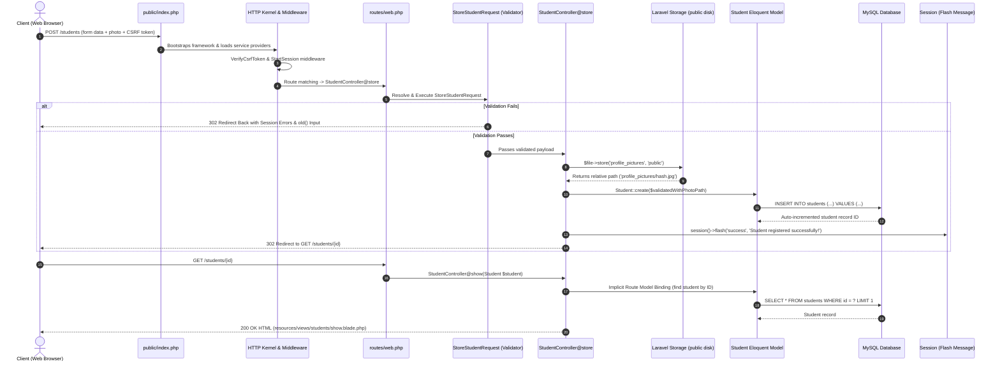
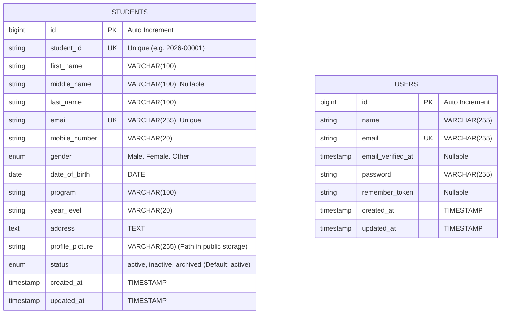

# ITST 302: Client-Server Technologies — Mini Project 03

# Student Registration System with Laravel Forms, Validation & File Storage


---

## Table of Contents

1. [Introduction](#1-introduction)
2. [Objectives](#2-objectives)
3. [Laravel Request Lifecycle](#3-laravel-request-lifecycle)
4. [Validation Rules](#4-validation-rules)
5. [Database Design](#5-database-design)
6. [Flowchart](#6-flowchart)
7. [Screenshots](#7-screenshots)
8. [Problems Encountered & Solutions](#8-problems-encountered--solutions)
9. [Reflection](#9-reflection)
10. [References](#10-references)
11. [Setup & Installation](#11-setup--installation)
12. [Original Requirements vs Modern Enhancements](#12-original-requirements-vs-modern-enhancements)

---

## 1. Introduction

The **Student Registration System** is a full-featured web application developed for **ITST 302: Client-Server Technologies (Week 4 Laboratory Activity / Mini Project 03)**. In client-server web architectures and higher education management systems, student registration forms represent a foundational touchpoint. Capturing student demographics, academic program assignments, and identity credentials requires robust server-side validation to maintain database integrity, prevent duplicate records, and defend against malicious user inputs.

This project implements the complete Laravel web stack—combining **Blade templates**, dedicated **Form Request validation (`StoreStudentRequest`, `UpdateStudentRequest`)**, **Laravel Storage disk abstraction** for secure image uploads, **MySQL relational database storage**, and responsive **Tailwind CSS**.

---

## 2. Objectives

The key learning and technical objectives accomplished in this project include:

- **Constructed Responsive Blade Forms**: Built sectioned, accessible registration and edit forms equipped with CSRF protection (`@csrf`) and `enctype="multipart/form-data"`.
- **Implemented Server-Side Validation**: Created decoupled Form Request classes enforcing uniqueness, format constraints, date boundaries, and file security.
- **Engineered Secure File Uploads**: Integrated Laravel's Storage subsystem (`Storage::disk('public')`) to sanitize filenames, isolate binary payloads from the database, and serve images via `php artisan storage:link`.
- **Delivered Flash Feedback & Validation UX**: Provided auto-dismissing toast notifications and per-field inline validation error indicators.
- **Architected Relational MySQL Storage**: Designed and migrated an indexed MySQL `students` table supporting lifecycle state tracking (`active`, `inactive`, `archived`).
- **Enhanced System Capabilities**: Extended core registration with an administrative analytics dashboard, live Chart.js registration metrics, search/filtering, and printable summary sheets.

---

## 3. Laravel Request Lifecycle

When a student registers, the incoming HTTP request traverses Laravel's core architecture as illustrated below:



Detailed documentation is available at [`documentation/request-lifecycle.md`](documentation/request-lifecycle.md).

---

## 4. Validation Rules

The application utilizes `App\Http\Requests\StoreStudentRequest` and `UpdateStudentRequest` to strictly enforce domain rules before any controller execution:

| Field             | Rule Constraints                                                 | Rationale & Security Consideration                              |
| ----------------- | ---------------------------------------------------------------- | --------------------------------------------------------------- |
| `student_id`      | `required`, `string`, `max:20`, `unique:students,student_id`     | Prevents duplicate student entries across academic years        |
| `first_name`      | `required`, `string`, `max:100`                                  | Mandatory identification                                        |
| `middle_name`     | `nullable`, `string`, `max:100`                                  | Optional middle name or initial                                 |
| `last_name`       | `required`, `string`, `max:100`                                  | Mandatory family name                                           |
| `email`           | `required`, `email`, `max:255`, `unique:students,email`          | Ensures unique, deliverable institutional communication address |
| `mobile_number`   | `required`, `string`, `regex:/^[0-9+\-\s()]{7,20}$/`             | Blocks invalid characters and enforces numeric telephone format |
| `gender`          | `required`, `in:Male,Female,Other`                               | Restricts values to valid enumeration options                   |
| `date_of_birth`   | `required`, `date`, `before:today`, `after:1900-01-01`           | Enforces realistic birth dates strictly in the past             |
| `program`         | `required`, `string`, `max:100`                                  | Verifies selected degree program                                |
| `year_level`      | `required`, `in:1st Year,2nd Year,3rd Year,4th Year`             | Constrains academic standing                                    |
| `address`         | `required`, `string`, `max:500`                                  | Captures physical residence details                             |
| `profile_picture` | `required` (on store), `image`, `mimes:jpg,jpeg,png`, `max:2048` | Restricts upload payloads to verified image binaries under 2MB  |

---

## 5. Database Design

The relational database is configured on **MySQL** with strict column constraints, indexing, and timestamps.



Detailed schema specifications are documented in [`documentation/er-diagram.md`](documentation/er-diagram.md).

---

## 6. Flowchart

The student registration business process flow:

```mermaid
flowchart TD
    Start([User Visits Registration Page]) --> ViewForm[Display Registration Form GET /students/create]
    ViewForm --> FillForm[User Inputs Personal, Contact, Academic Info & Selects Photo]
    FillForm --> JSPreview[Client-Side Image Preview via FileReader API]
    JSPreview --> Submit[Submit POST /students]

    Submit --> Route[routes/web.php routes to StudentController@store]
    Route --> FormReq[StoreStudentRequest Form Validation]

    FormReq --> IsValid{Is Input Valid?}

    IsValid -- No --> ValidationFail[Redirect back with Input & Errors]
    ValidationFail --> DisplayErrors[Display Inline Field Errors & Summary Alert]
    DisplayErrors --> FillForm

    IsValid -- Yes --> SaveImage[Store Image in storage/app/public/profile_pictures]
    SaveImage --> SaveDB[Insert Student Record in MySQL students Table]
    SaveDB --> FlashSuccess[Flash Success Session Message]
    FlashSuccess --> RedirectShow[Redirect to GET /students/{id}]
    RedirectShow --> ViewProfile[Display Student Profile with Uploaded Picture]
    ViewProfile --> End([Registration Complete])
```

Detailed flow descriptions are located in [`documentation/registration-flowchart.md`](documentation/registration-flowchart.md).

---

## 7. Screenshots

Project demonstration screenshots are archived in the [`screenshots/`](screenshots/) directory:

- **Registration Form**: Responsive form with categorized sections and upload preview (`screenshots/01_registration_form.png`)
- **Validation Errors**: Inline field error badges and top alert summaries (`screenshots/02_validation_errors.png`)
- **Flash Success Notification**: Dismissible success alert upon persistence (`screenshots/03_flash_success.png`)
- **Student Profile View**: Profile card rendering student details and uploaded avatar (`screenshots/04_student_profile.png`)
- **Student Directory Table**: Searchable, filterable student listing with pagination (`screenshots/05_student_list.png`)
- **Admin Dashboard**: Real-time statistics, distribution metrics, and Chart.js trend (`screenshots/06_dashboard.png`)
- **Printable Summary View**: Print CSS layout formatted for documentation (`screenshots/07_print_summary.png`)

---

## 8. Problems Encountered & Solutions

### 1. Handling File Upload Security and Orphaned Files on Update

- **Problem**: Allowing arbitrary file uploads poses serious security vulnerabilities (e.g., executing remote script binaries), and updating a student's profile photo leaves old files orphaned in storage.
- **Solution**: Implemented strict MIME/extension/size validation (`image|mimes:jpg,jpeg,png|max:2048`) inside `StoreStudentRequest` and `UpdateStudentRequest`. In `StudentController@update`, when a new image is provided, `Storage::disk('public')->delete($student->profile_picture)` is executed to clean up old assets before writing the newly hashed file.

### 2. Form Input Retention & Image Preview UX

- **Problem**: When server validation fails, re-rendering the form normally clears the selected image, confusing the user about their upload status.
- **Solution**: Developed a lightweight JavaScript FileReader helper using Alpine.js (`x-data="imagePreview()"`) that gives immediate client-side visual confirmation before submission, while standard form inputs utilize Laravel's `old('field_name')` helper to preserve user entries.

### 3. Unique Validation Conflicts During Record Updates

- **Problem**: Performing standard `unique:students,student_id` validation during an edit operation causes false validation errors against the current student's own existing record.
- **Solution**: Created `UpdateStudentRequest` utilizing Laravel's `Rule::unique('students', 'column')->ignore($studentId)` to ignore the active record while continuing to protect against collisions with other records.

---

## 9. Reflection

Building the **Student Registration System** for Week 4 reinforced essential concepts in modern client-server application design. While frontend frameworks offer rich client-side interactivity, server-side validation remains the ultimate authority for protecting business rules, securing database integrity, and preventing data corruption.

Working with Laravel’s Form Requests highlighted the benefits of separating validation logic from HTTP controllers. This separation keeps controllers lean and maintainable while ensuring that only sanitized, validated data reaches the Eloquent ORM.

Furthermore, handling file uploads demonstrated the importance of file abstraction. Storing uploaded binaries on disk (`storage/app/public`) while recording only relative paths in MySQL keeps the database lightweight, query-efficient, and easily scalable. Integrating Tailwind CSS, Alpine.js, Chart.js, and automated Feature tests (`StudentRegistrationTest`) produced an application that is not only fully compliant with the laboratory requirements but also representative of production-ready standards.

---

## 10. References

- **Laravel Documentation (v13.x)**. (2026). _Routing, Validation, Eloquent ORM, and File Storage_. https://laravel.com/docs
- **PHP Documentation**. (2026). _PHP 8.3 Manual — Filesystem & Image Processing_. https://www.php.net/manual/en/
- **MySQL Reference Manual**. (2026). _MySQL 8.0 Data Types & Constraints_. https://dev.mysql.com/doc/refman/8.0/en/
- **Tailwind CSS Documentation**. (2026). _Tailwind CSS v4 Utility Framework_. https://tailwindcss.com/docs
- **Alpine.js Documentation**. (2026). _Lightweight Reactive UI Components_. https://alpinejs.dev/

---

## 11. Setup & Installation

Follow these exact steps in **Windows PowerShell** to run the application locally:

```powershell
# 1. Clone repository & enter directory
git clone https://github.com/ejrdeleon/week04-student-registration.git
cd week04-student-registration

# 2. Install PHP backend dependencies
composer install

# 3. Environment configuration
copy .env.example .env
php artisan key:generate

# 4. Configure MySQL Database in .env:
# DB_CONNECTION=mysql
# DB_HOST=127.0.0.1
# DB_PORT=3306
# DB_DATABASE=student_registration
# DB_USERNAME=root
# DB_PASSWORD=

# 5. Create storage symlink for public image access
php artisan storage:link

# 6. Run database migrations & seed demo student records
php artisan migrate:fresh --seed

# 7. Install frontend dependencies & compile assets
npm install
npm run build

# 8. Start local servers
# In Terminal 1 (Vite Dev Server):
npm run dev

# In Terminal 2 (Laravel Backend):
php artisan serve
```

Access the system at **`http://127.0.0.1:8000`**.

To execute the automated test suite:

```powershell
php artisan test
```

---

## 12. Original Requirements vs Modern Enhancements

| Feature Area           | Official Week 4 Requirement                      | Modernized Enhancements Added                                                            |
| ---------------------- | ------------------------------------------------ | ---------------------------------------------------------------------------------------- |
| **Registration Form**  | Blade template, standard inputs, image upload    | Categorized sections, Alpine.js live image preview, inline field errors                  |
| **Validation**         | Server-side validation rules in controller       | Decoupled `StoreStudentRequest` and `UpdateStudentRequest`, custom messages              |
| **File Storage**       | Laravel Storage in `storage/app/public`, DB path | Automated storage directory creation, old file deletion on update, thumbnail helpers     |
| **Database**           | MySQL `students` table                           | Added lifecycle `status` (Active, Inactive, Archived), `StudentFactory`, `StudentSeeder` |
| **Student Listing**    | Basic student table                              | Full search bar, Program/Year Level filter dropdowns, status pills, pagination           |
| **Student Profile**    | Display details & uploaded photo                 | Modern identity card, print-optimized stylesheet (`window.print()`)                      |
| **Student Management** | Create & Show                                    | Added Edit/Update (`PUT /students/{id}`) and Soft-Archive (`DELETE /students/{id}`)      |
| **Dashboard**          | Not required                                     | Interactive analytics dashboard with Chart.js registration trend line                    |
| **Testing**            | Default                                          | Complete feature test suite covering validation, uploads, and CRUD operations            |
