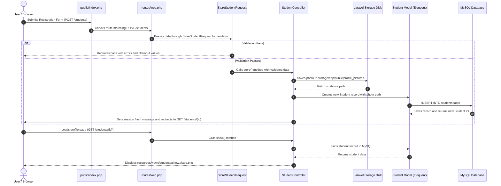
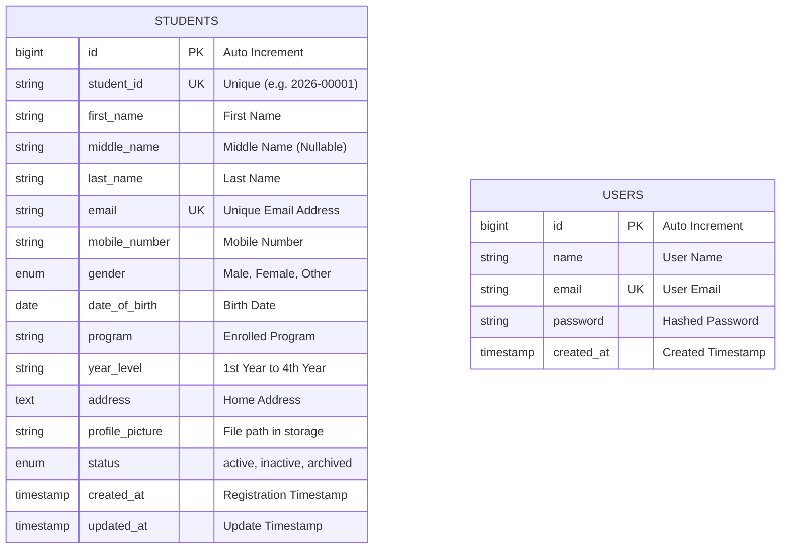
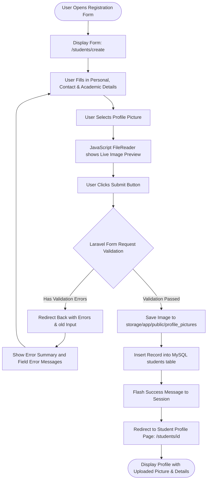

# Student Registration System — ITST 302 Week 4 Laboratory Activity

**Course:** ITST 302 – Client-Server Technologies  
**Activity:** Week 4 Laboratory Activity / Mini Project 03  
**Project Name:** Student Registration System  
**Framework:** Laravel 13 (PHP 8.3+) with MySQL & Tailwind CSS

---

## Table of Contents

1. [Introduction](#1-introduction)
2. [Objectives](#2-objectives)
3. [Laravel Request Lifecycle](#3-laravel-request-lifecycle)
4. [Validation Rules](#4-validation-rules)
5. [Database Design](#5-database-design)
6. [Flowchart](#6-flowchart)
7. [Screenshots](#7-screenshots)
8. [Problems Encountered & Solutions](#8-problems-encountered--solutions)
9. [Reflection](#9-reflection)
10. [References](#10-references)
11. [Setup Instructions](#11-setup-instructions)
12. [Features & Enhancements Summary](#12-features--enhancements-summary)

---

## 1. Introduction

For our ITST 302 Week 4 laboratory activity, we were tasked to develop a **Student Registration System** using the Laravel framework and MySQL. In real-world university or school portals, student registration is one of the most important client-server features because it handles personal records, academic enrollment, and identification.

The goal of this mini project is to build a working system that allows students to register with their complete details (Student ID, full name, contact info, program, year level, address) and upload a profile picture. The application enforces server-side validation to ensure that records are clean and duplicate-free, stores uploaded images securely using Laravel Storage (`storage/app/public`), saves data into a MySQL `students` table, and presents a confirmation profile page with flash messages after successful submission.

---

## 2. Objectives

The objectives for this laboratory activity are:

- Build a responsive student registration form using Laravel Blade templates.
- Implement server-side validation using Form Requests (`StoreStudentRequest`, `UpdateStudentRequest`).
- Handle file uploads (JPG/PNG profile pictures up to 2MB) using Laravel Storage and create public symlinks with `php artisan storage:link`.
- Design and migrate a MySQL `students` table to store all required fields and file paths.
- Display flash success and error notifications when interacting with the system.
- Build a student profile page to review registered details and uploaded images.
- Provide student record management with search, program filters, record editing, archiving, and a print summary view.

---

## 3. Laravel Request Lifecycle

Here is how an HTTP request travels through the Laravel application during student registration:



### Explanation of Steps:

1. **User Submits Form**: The student fills out the form at `/students/create` and clicks "Register Student". The browser sends a `POST` request with form data, CSRF token, and the image file.
2. **Routing & Form Request Validation**: `routes/web.php` directs the request to `StoreStudentRequest`. Laravel validates all required fields, checks for duplicate Student IDs and emails in MySQL, and verifies the image format and size.
3. **If Validation Fails**: Laravel redirects the user back to the form with error messages and their previous inputs (`old()`).
4. **If Validation Passes**: `StudentController@store` receives the validated input, uploads the image into `storage/app/public/profile_pictures`, and passes the relative path along with student data to `Student::create()`.
5. **Database Storage & Redirect**: Eloquent inserts the record into the MySQL `students` table. The controller flashes a success message into the session and redirects the user to `/students/{id}` where the newly registered student details and uploaded picture are rendered.

---

## 4. Validation Rules

We separated our validation logic into dedicated Form Request classes (`StoreStudentRequest` and `UpdateStudentRequest`) for clean and reusable code:

| Field             | Validation Rule                                                   | Reason / Explanation                                                   |
| ----------------- | ----------------------------------------------------------------- | ---------------------------------------------------------------------- |
| `student_id`      | `required`, `string`, `max:20`, `unique:students,student_id`      | Required school ID number; must be unique to avoid duplicate records.  |
| `first_name`      | `required`, `string`, `max:100`                                   | Student given name is required.                                        |
| `middle_name`     | `nullable`, `string`, `max:100`                                   | Optional middle name or initial.                                       |
| `last_name`       | `required`, `string`, `max:100`                                   | Student surname is required.                                           |
| `email`           | `required`, `email`, `max:255`, `unique:students,email`           | Valid email address; must be unique per student.                       |
| `mobile_number`   | `required`, `string`, `regex:/^[0-9+\-\s()]{7,20}$/`              | Contact number; ensures valid telephone or mobile format.              |
| `gender`          | `required`, `in:Male,Female,Other`                                | Ensures gender matches allowed selections.                             |
| `date_of_birth`   | `required`, `date`, `before:today`, `after:1900-01-01`            | Birth date must be a valid date in the past.                           |
| `program`         | `required`, `string`, `max:100`                                   | Student must select their enrolled academic program.                   |
| `year_level`      | `required`, `in:1st Year,2nd Year,3rd Year,4th Year`              | Selects valid undergraduate year standing.                             |
| `address`         | `required`, `string`, `max:500`                                   | Student home/residential address is required.                          |
| `profile_picture` | `required` (on create), `image`, `mimes:jpg,jpeg,png`, `max:2048` | Photo upload is mandatory for registration; accepts JPG/PNG up to 2MB. |

---

## 5. Database Design

The application uses MySQL with a primary `students` table and supporting tables created via Laravel migrations.



### Table Structure: `students`

```sql
CREATE TABLE `students` (
  `id` bigint unsigned NOT NULL AUTO_INCREMENT,
  `student_id` varchar(20) NOT NULL UNIQUE,
  `first_name` varchar(100) NOT NULL,
  `middle_name` varchar(100) DEFAULT NULL,
  `last_name` varchar(100) NOT NULL,
  `email` varchar(255) NOT NULL UNIQUE,
  `mobile_number` varchar(20) NOT NULL,
  `gender` enum('Male','Female','Other') NOT NULL,
  `date_of_birth` date NOT NULL,
  `program` varchar(100) NOT NULL,
  `year_level` varchar(20) NOT NULL,
  `address` text NOT NULL,
  `profile_picture` varchar(255) NOT NULL,
  `status` enum('active','inactive','archived') NOT NULL DEFAULT 'active',
  `created_at` timestamp NULL DEFAULT NULL,
  `updated_at` timestamp NULL DEFAULT NULL,
  PRIMARY KEY (`id`)
);
```

---

## 6. Flowchart

This flowchart shows the complete user registration process from opening the form to viewing the finished profile:



---

## 7. Screenshots

Screenshots of the working application are stored in the [`screenshots/`](screenshots/) directory:

1. **`01_registration_form.png`** — Student registration form with categorized sections and photo upload box.
2. **`02_validation_errors.png`** — Form with validation errors triggered (inline red field messages and summary box).
3. **`03_flash_success.png`** — Success alert banner after registering a student.
4. **`04_student_profile.png`** — Student details page showing the uploaded profile image, student ID, and info cards.
5. **`05_student_list.png`** — Student list table with search bar, program/year filters, and status badges.
6. **`06_dashboard.png`** — Dashboard overview with total counts, program breakdown, and recent registrations.
7. **`07_print_summary.png`** — Print summary preview formatted for printing/PDF export.

---

## 8. Problems Encountered & Solutions

During development and testing, here are the main problems we encountered and how we fixed them:

### 1. Uploaded Profile Pictures Not Displaying (404 Error)

- **Problem**: When a student was registered, their image path was saved in MySQL, but the image showed a broken image icon on the profile page.
- **Solution**: Laravel stores public files under `storage/app/public`, which is not directly accessible by default. We ran `php artisan storage:link` to create a symlink from `public/storage` to `storage/app/public` and referenced pictures using `asset('storage/' . $student->profile_picture)`.

### 2. MySQL Connection Access Denied Error

- **Problem**: While running migrations, Laravel threw `SQLSTATE[HY000] [1045] Access denied for user 'root'@'localhost' (using password: NO)`.
- **Solution**: The local MySQL service had a root password configured. We updated `DB_PASSWORD` in `.env` to match the local MySQL password, created the `student_registration` database schema, and ran `php artisan config:clear` so Laravel picked up the updated configuration.

### 3. Unique Validation Failing When Editing a Student

- **Problem**: When updating an existing student's record without changing their Student ID or email, Laravel's `unique` validation threw an error claiming the ID/email was already taken.
- **Solution**: In `UpdateStudentRequest`, we used `Rule::unique('students', 'student_id')->ignore($studentId)` so Laravel ignores the current student's record when validating uniqueness during edits.

### 4. Replacing Old Profile Pictures on Update

- **Problem**: When a student uploaded a new photo during profile editing, the new file was uploaded, but the old file remained on disk, wasting storage space over time.
- **Solution**: In `StudentController@update`, we checked if a new file was uploaded and deleted the previous photo file from storage using `Storage::disk('public')->delete($student->profile_picture)` before saving the new path.

---

## 9. Reflection

Working on this Week 4 Student Registration System helped me understand how full-stack client-server web applications operate in Laravel.

First, I learned the importance of **server-side validation**. While frontend HTML validation is good for quick user feedback, client-side checks can be bypassed easily. Laravel's Form Requests allowed us to strictly validate data types, string lengths, date ranges, and unique database constraints before anything reaches the controller or database.

Second, I gained hands-on experience with **file upload handling and Laravel Storage**. I learned that storing raw binary files inside a database is bad practice because it bloats database size and slows down queries. Instead, saving the file to the filesystem (`storage/app/public`) and saving only the relative file path in MySQL makes the application clean, secure, and performant.

Lastly, building features like live image previews with JavaScript, reusable Blade components, search filtering, and test cases gave me a much clearer picture of how real-world university portals are designed and maintained.

---

## 10. References

- Laravel 13 Documentation — [Validation & Form Requests](https://laravel.com/docs/validation)
- Laravel 13 Documentation — [File Storage & Public Disks](https://laravel.com/docs/filesystem)
- Laravel 13 Documentation — [Eloquent ORM & Migrations](https://laravel.com/docs/eloquent)
- PHP Documentation — [File Uploads Handling](https://www.php.net/manual/en/features.file-upload.php)
- MySQL Reference Manual — [Data Types & Constraints](https://dev.mysql.com/doc/refman/8.0/en/)
- Tailwind CSS Docs — [Form Elements & Responsive Utilities](https://tailwindcss.com/docs)

---

## 11. Setup Instructions

To run this project locally on Windows:

```powershell
# 1. Clone the repository and navigate into the folder
git clone https://github.com/ejrdeleon/week04-student-registration.git
cd week04-student-registration

# 2. Install PHP and Composer dependencies
composer install

# 3. Setup the environment file
copy .env.example .env
php artisan key:generate

# 4. In your .env file, ensure your MySQL settings are correct:
# DB_CONNECTION=mysql
# DB_HOST=127.0.0.1
# DB_PORT=3306
# DB_DATABASE=student_registration
# DB_USERNAME=root
# DB_PASSWORD=your_mysql_password

# 5. Create the storage symlink for uploaded profile photos
php artisan storage:link

# 6. Run migrations and seed fictional student records
php artisan migrate:fresh --seed

# 7. Install node packages & build frontend assets
npm install
npm run build

# 8. Start local development servers
# Terminal 1:
npm run dev

# Terminal 2:
php artisan serve
```

Open your browser and visit: **`http://localhost:8000`**

To run the automated PHPUnit feature tests:

```powershell
php artisan test
```

---

## 12. Features & Enhancements Summary

| Feature               | Base Laboratory Requirement                 | How It Is Implemented in this Project                                                     |
| --------------------- | ------------------------------------------- | ----------------------------------------------------------------------------------------- |
| **Registration Form** | Blade form with required student fields     | Sectioned layout (Personal, Contact, Academic, Photo) with live JS preview                |
| **Server Validation** | Controller-level validation                 | Dedicated `StoreStudentRequest` & `UpdateStudentRequest` with custom messages             |
| **Profile Picture**   | Upload photo stored in `storage/app/public` | Validated (JPG/PNG max 2MB), saved via Laravel Storage, displayed on profile              |
| **Database**          | MySQL `students` table                      | MySQL table with all required fields + `status` column (`active`, `inactive`, `archived`) |
| **Flash Messages**    | Show success/error notifications            | Auto-dismissing flash alerts with icons for success and errors                            |
| **Student Profile**   | View registered student details             | Profile card with avatar display, status badge, and printable summary view                |
| **Student List**      | Basic student list                          | Table with search bar (ID/name/email), Program/Year Level filters, and pagination         |
| **Student Edit**      | Standard update capability                  | Edit view with pre-filled inputs, status updater, and photo replacement                   |
| **Dashboard**         | Not strictly required                       | Overview dashboard showing enrollment stats, program distribution, and recent list        |
| **Automated Tests**   | Default tests                               | 14 Feature tests testing validation, uploads, duplicate rejection, and CRUD actions       |
