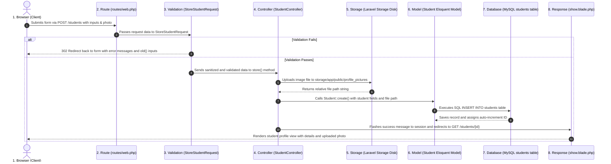
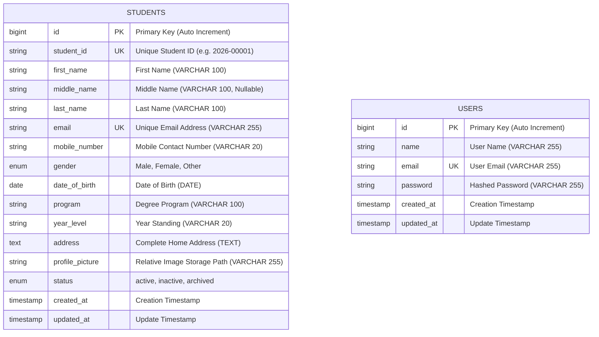
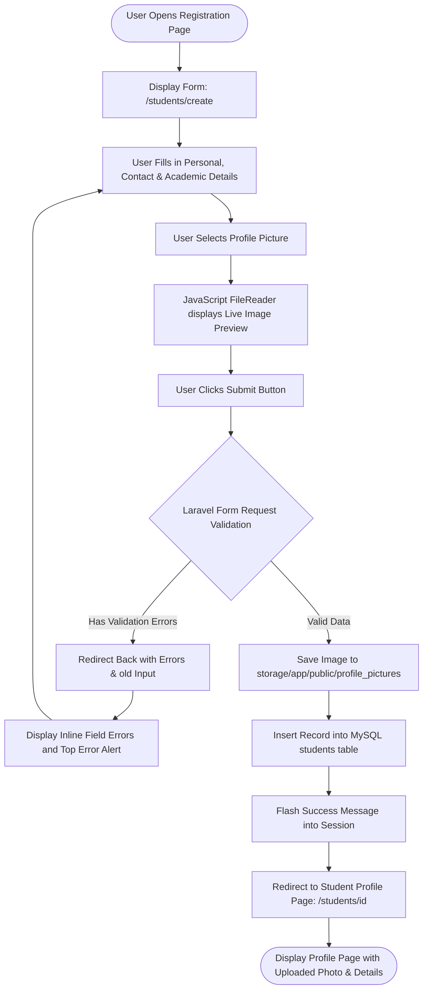

# Student Registration System — ITST 302 Week 4 Laboratory Activity

**Course:** ITST 302 – Client-Server Technologies  
**Laboratory Activity:** Week 4 / Mini Project 03  
**Student Name:** [Your Name]  
**Year & Section:** BSIT 3rd Year  

---

## 1. Project Title
**Student Registration System with Laravel Forms, Server-Side Validation, and File Storage**

---

## 2. Introduction

### Purpose of a Student Registration System
A Student Registration System is a core web application used by schools and universities to enroll students, gather their personal and academic information, and assign them to degree programs. It allows students or registrars to enter key data such as Student ID, complete name, contact information, date of birth, gender, home address, and an official 2x2 profile picture for identification.

### Importance of Data Validation
Data validation ensures that the information entered into the system is complete, correctly formatted, and accurate before it reaches the database. Without validation, users could submit blank forms, invalid email addresses, letters in phone numbers, or fake birth dates. More importantly, server-side validation protects the database from duplicate student records, corrupted data, and malicious file uploads (like PHP scripts disguised as images).

### Role of Registration Systems in Enterprise Applications
In enterprise and institutional software, the registration module is the entry point for all user data. Enterprise Resource Planning (ERP) systems, Learning Management Systems (LMS), and Student Information Systems (SIS) rely on the registration module to create the primary user profile. If data collected at the registration stage is dirty or unstructured, every downstream system—such as grading, attendance, billing, and graduation auditing—will encounter errors.

---

## 3. Objectives

During this laboratory activity, I accomplished the following learning objectives:
- Created responsive HTML web forms using Laravel Blade templates (`@csrf`, `enctype="multipart/form-data"`).
- Implemented server-side data validation using dedicated Laravel Form Request classes (`StoreStudentRequest` and `UpdateStudentRequest`).
- Configured file uploads for profile pictures (JPG, JPEG, PNG up to 2MB) using Laravel Storage (`storage/app/public`).
- Created public storage symlinks using the `php artisan storage:link` command.
- Designed and migrated a relational MySQL database table (`students`) with proper data types, unique keys, and constraints.
- Displayed session flash messages and per-field inline error messages to guide the user during form submission.
- Built a student profile page to display registered details and render uploaded images securely.
- Added student record management features including a searchable directory, program filters, record editing, and print-ready summary sheets.

---

## 4. Laravel Request Lifecycle

When a student submits the registration form, the request moves through Laravel's client-server architecture in the following sequence:

### Step-by-Step Explanation:
1. **Browser**: The user fills out the form at `/students/create`, selects a photo, and clicks the submit button, sending an HTTP `POST` request with form data and the `@csrf` token.
2. **Route**: `routes/web.php` catches the `POST /students` request and points it to `StudentController@store`.
3. **Validation**: Before entering the controller method, Laravel resolves `StoreStudentRequest` to check all required fields, format rules, unique constraints, and image size limits. If any rule fails, Laravel automatically redirects back with error messages.
4. **Controller**: If validation passes, `StudentController@store()` receives the validated data.
5. **Storage**: The controller saves the uploaded file into `storage/app/public/profile_pictures` and gets the generated path string.
6. **Model**: The `Student` Eloquent Model maps the validated data and photo path to table attributes.
7. **Database**: Eloquent executes the SQL `INSERT` statement into the MySQL `students` table.
8. **Response**: The controller sets a flash success notification in the session and redirects the browser to `GET /students/{id}`, where `show.blade.php` displays the newly saved profile.

---

## 5. Validation Rules

The following validation rules are defined in `StoreStudentRequest` to ensure data integrity and security:

| Field | Validation Rule | Why This Rule is Important |
|---|---|---|
| `student_id` | `required`, `string`, `max:20`, `unique:students,student_id` | **Required & Unique Constraint**: Every student must have a Student ID, and it must be unique in the database to prevent duplicate enrollments. |
| `first_name` | `required`, `string`, `max:100` | **Required Field**: Student's first name is mandatory for official records. |
| `middle_name` | `nullable`, `string`, `max:100` | **Optional Field**: Allows students with no middle name to submit without errors. |
| `last_name` | `required`, `string`, `max:100` | **Required Field**: Surname is required for identification and alphabetical listing. |
| `email` | `required`, `email`, `max:255`, `unique:students,email` | **Email & Unique Validation**: Ensures the email is in a valid format (`name@domain.com`) and not already used by another student. |
| `mobile_number` | `required`, `string`, `regex:/^[0-9+\-\s()]{7,20}$/` | **Numeric / Format Validation**: Prevents letters and junk characters in contact numbers while supporting standard phone formats. |
| `gender` | `required`, `in:Male,Female,Other` | **Restricted Values**: Restricts input to valid choices from the dropdown. |
| `date_of_birth` | `required`, `date`, `before:today`, `after:1900-01-01` | **Date Validation**: Ensures the birth date is a valid calendar date strictly in the past. |
| `program` | `required`, `string`, `max:100` | **Required Field**: Ensures the student chooses their degree program. |
| `year_level` | `required`, `in:1st Year,2nd Year,3rd Year,4th Year` | **Restricted Values**: Ensures the student belongs to a valid undergraduate year level. |
| `address` | `required`, `string`, `max:500` | **Required Field**: Captures physical residence for student records. |
| `profile_picture` | `required`, `image`, `mimes:jpg,jpeg,png`, `max:2048` | **Image & File Size Restriction**: Restricts upload to safe image formats (`.jpg`, `.jpeg`, `.png`) and limits file size to **2MB (2048 KB)** to prevent server disk overflow and block malicious executable files. |

---

## 6. Database Design

### Entity-Relationship Diagram (ERD)

### Table Structure & Constraints: `students` Table

| Column Name | Data Type | Key / Index | Nullable | Default Value | Constraints & Description |
|---|---|---|---|---|---|
| `id` | `BIGINT UNSIGNED` | `PRIMARY KEY` | No | Auto Increment | Unique record identifier |
| `student_id` | `VARCHAR(20)` | `UNIQUE` | No | None | Unique school ID number |
| `first_name` | `VARCHAR(100)` | None | No | None | Student given name |
| `middle_name` | `VARCHAR(100)` | None | Yes | `NULL` | Optional middle name or initial |
| `last_name` | `VARCHAR(100)` | None | No | None | Student family name / surname |
| `email` | `VARCHAR(255)` | `UNIQUE` | No | None | Unique primary email |
| `mobile_number` | `VARCHAR(20)` | None | No | None | Contact number |
| `gender` | `ENUM('Male','Female','Other')` | None | No | None | Gender option |
| `date_of_birth` | `DATE` | None | No | None | Birth date format (`YYYY-MM-DD`) |
| `program` | `VARCHAR(100)` | None | No | None | Academic degree program |
| `year_level` | `VARCHAR(20)` | None | No | None | Academic year standing |
| `address` | `TEXT` | None | No | None | Complete residential address |
| `profile_picture` | `VARCHAR(255)` | None | No | None | Relative path in public storage disk |
| `status` | `ENUM('active','inactive','archived')` | None | No | `'active'` | Student record lifecycle status |
| `created_at` | `TIMESTAMP` | None | Yes | `NULL` | Record creation timestamp |
| `updated_at` | `TIMESTAMP` | None | Yes | `NULL` | Record last modified timestamp |

---

## 7. Flowchart

---

## 8. Screenshots

*(Screenshots are saved in the `screenshots/` directory for submission)*

1. **Registration Form**: `screenshots/01_registration_form.png` — Form layout with input fields and photo upload box.
2. **Validation Errors**: `screenshots/02_validation_errors.png` — Inline error messages below invalid fields and error summary alert at top.
3. **Successful Registration**: `screenshots/03_flash_success.png` — Flash banner notification confirming student registration.
4. **Flash Message**: `screenshots/03_flash_success.png` — Dismissible green success notification banner.
5. **Uploaded Profile Picture**: `screenshots/04_student_profile.png` — Student profile card showing the rendered profile image from storage.
6. **Database Table**: `screenshots/06_database_table.png` — phpMyAdmin / MySQL Workbench view of the `students` table data.
7. **Student Profile Page**: `screenshots/04_student_profile.png` — Detailed student profile view.
8. **VS Code Project Structure**: `screenshots/07_vscode_structure.png` — Project directory tree in VS Code editor.
9. **GitHub Repository**: `screenshots/08_github_repo.png` — GitHub repository page with commits and documentation.

---

## 9. Problems Encountered

During the development and testing of this project, I encountered several practical challenges:

1. **Broken Profile Picture Links (404 Not Found)**:  
   After successfully uploading a photo, the image path was stored in MySQL, but the profile page showed a broken image icon because files stored in `storage/app/public` are not accessible directly from the browser by default.

2. **MySQL Connection Access Denied (`1045 Access Denied`)**:  
   When running database migrations, Laravel threw an exception: `SQLSTATE[HY000] [1045] Access denied for user 'root'@'localhost' (using password: NO)`. This was caused by the local MySQL root user having a password set while the `.env` file had an empty `DB_PASSWORD=`.

3. **Unique Validation Failing During Student Edit**:  
   When building the student edit feature, submitting the form without changing the Student ID or email triggered validation errors saying the Student ID/email was already taken, because Laravel was comparing the input against the student's own existing database record.

4. **Orphaned Profile Images When Updating Photos**:  
   When a student uploaded a new replacement photo on the edit page, the new image was saved, but the old image file remained in storage, creating orphaned unused files on the server.

---

## 10. Solutions

Here is how each problem was solved:

1. **Fixing Broken Image Links**:  
   Ran `php artisan storage:link` in the terminal to create a symbolic link from `public/storage` to `storage/app/public`. In Blade templates, referenced images using `asset('storage/' . $student->profile_picture)`.

2. **Resolving MySQL Access Denied**:  
   Updated the `.env` file with the correct MySQL credentials (`DB_PASSWORD=4110`), created the `student_registration` database schema in MySQL, and ran `php artisan config:clear` so Laravel refreshed its cached settings.

3. **Fixing Unique Validation on Edit**:  
   Created a separate `UpdateStudentRequest` class that uses Laravel's `Rule::unique('students', 'student_id')->ignore($studentId)` to tell the validator to ignore the current student's record when checking uniqueness during updates.

4. **Cleaning Up Old Files on Photo Replacement**:  
   In `StudentController@update()`, added a check: if a new file is uploaded and the existing photo is not the default placeholder, `Storage::disk('public')->delete($student->profile_picture)` is executed to delete the old file before saving the new photo.

---

## 11. Reflection

Working on the Week 4 Student Registration System provided me with valuable hands-on experience in building a complete client-server web application using Laravel and MySQL.

The most important lesson I learned is the critical importance of **server-side validation**. While frontend validation (such as HTML `required` attributes or JavaScript alerts) provides a quick and smooth user experience, it can easily be bypassed by disabling JavaScript or using tools like Postman. Server-side validation acts as the true defense layer of an application, guaranteeing that only clean, well-formatted, and safe data reaches the database. Using Laravel's Form Request classes made this process clean and organized by keeping validation rules separate from controller logic.

I also learned the correct way to handle **file uploads and file security**. In my earlier programming exercises, I thought about storing images directly as binary BLOB data inside the database. However, this project taught me that storing files on the server filesystem (`storage/app/public`) and saving only the relative file path string in MySQL is much more efficient. It keeps the database lightweight and fast. Furthermore, restricting uploads to specific MIME types (`jpg`, `jpeg`, `png`) and enforcing a 2MB size limit is essential to protect the server from disk exhaustion and malicious file execution attacks.

In real-world enterprise applications, registration systems serve as the core entry point for user identity and data consistency. Experiencing how Laravel connects Blade views, Form Requests, Controllers, Eloquent ORM, and MySQL migrations helped me understand how modern web frameworks streamline full-stack development while maintaining high standards of data integrity and security.

---

## 12. References

American Psychological Association (APA 7th Edition) References:

- Laravel. (2026). *Laravel documentation: Validation and Form Requests*. Laravel. https://laravel.com/docs/validation
- Laravel. (2026). *Laravel documentation: File storage and public disks*. Laravel. https://laravel.com/docs/filesystem
- Laravel. (2026). *Laravel documentation: Eloquent ORM and database migrations*. Laravel. https://laravel.com/docs/eloquent
- MDN Web Docs. (2026). *Using files from web applications and FileReader API*. Mozilla. https://developer.mozilla.org/en-US/docs/Web/API/File_API/Using_files_from_web_applications
- MySQL. (2026). *MySQL 8.0 reference manual: Data types and table constraints*. Oracle Corporation. https://dev.mysql.com/doc/refman/8.0/en/
- PHP Documentation Group. (2026). *PHP manual: Handling file uploads and POST method uploads*. The PHP Group. https://www.php.net/manual/en/features.file-upload.post-method.php
- Tailwind Labs. (2026). *Tailwind CSS documentation: Utility-first CSS framework*. Tailwind Labs. https://tailwindcss.com/docs
