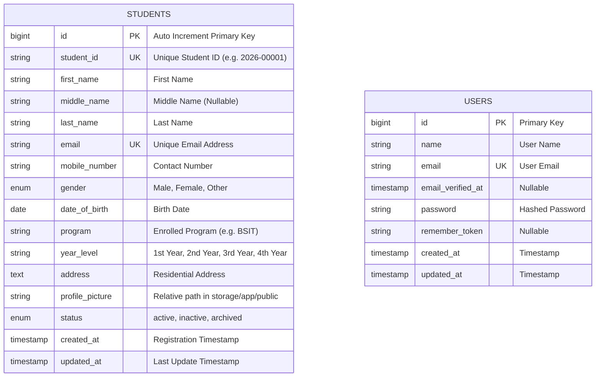

# Database Entity-Relationship Diagram (ERD)

## Database Overview

The Student Registration System uses MySQL database storage with a primary `students` table to store student profile information and the relative paths of uploaded profile images.

## `students` Table Columns

| Column            | Data Type                            | Constraints                 | Description                                      |
| ----------------- | ------------------------------------ | --------------------------- | ------------------------------------------------ |
| `id`              | BIGINT UNSIGNED                      | PRIMARY KEY, AUTO_INCREMENT | Auto-incrementing record ID                      |
| `student_id`      | VARCHAR(20)                          | UNIQUE, NOT NULL            | Student ID number (must be unique)               |
| `first_name`      | VARCHAR(100)                         | NOT NULL                    | Given first name                                 |
| `middle_name`     | VARCHAR(100)                         | NULLABLE                    | Optional middle name or initial                  |
| `last_name`       | VARCHAR(100)                         | NOT NULL                    | Family name / surname                            |
| `email`           | VARCHAR(255)                         | UNIQUE, NOT NULL            | Student email address (must be unique)           |
| `mobile_number`   | VARCHAR(20)                          | NOT NULL                    | Contact telephone / mobile number                |
| `gender`          | ENUM('Male','Female','Other')        | NOT NULL                    | Selected gender                                  |
| `date_of_birth`   | DATE                                 | NOT NULL                    | Date of birth                                    |
| `program`         | VARCHAR(100)                         | NOT NULL                    | Degree program (e.g., BS Information Technology) |
| `year_level`      | VARCHAR(20)                          | NOT NULL                    | Academic year (e.g., 3rd Year)                   |
| `address`         | TEXT                                 | NOT NULL                    | Complete home address                            |
| `profile_picture` | VARCHAR(255)                         | NOT NULL                    | Path inside `storage/app/public` disk            |
| `status`          | ENUM('active','inactive','archived') | DEFAULT 'active'            | Student record status                            |
| `created_at`      | TIMESTAMP                            | NULLABLE                    | Timestamp when record was created                |
| `updated_at`      | TIMESTAMP                            | NULLABLE                    | Timestamp when record was last updated           |
