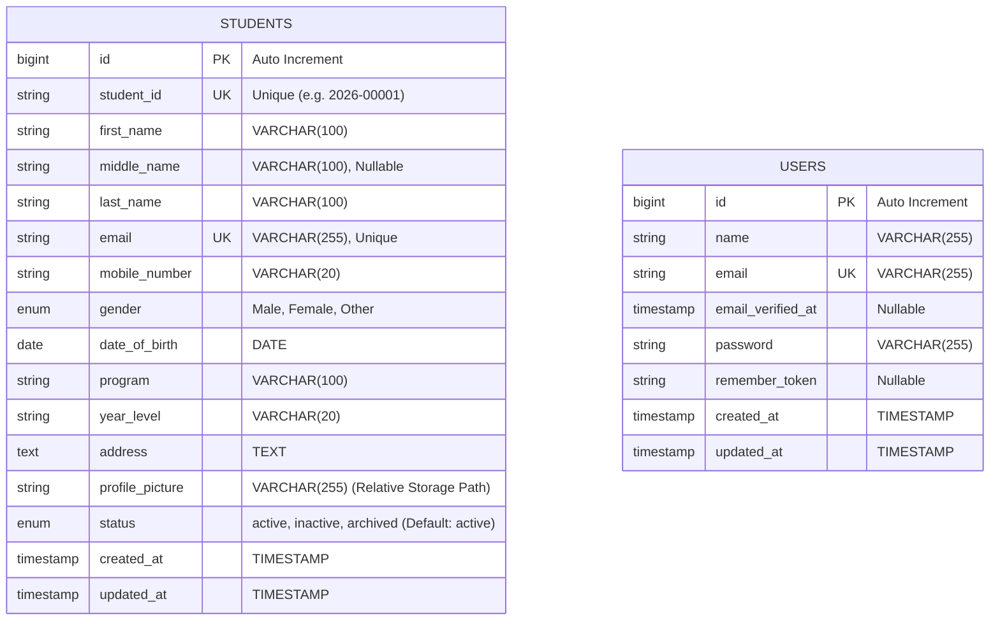

# Database Entity-Relationship Diagram (ERD)

## Schema Overview

The Student Registration System uses MySQL to store student records and user accounts.

## `students` Table Specification

| Column            | Type                                 | Constraints                 | Description                          |
| ----------------- | ------------------------------------ | --------------------------- | ------------------------------------ |
| `id`              | BIGINT UNSIGNED                      | PRIMARY KEY, AUTO_INCREMENT | Unique internal record identifier    |
| `student_id`      | VARCHAR(20)                          | UNIQUE, NOT NULL            | School Student Identification Number |
| `first_name`      | VARCHAR(100)                         | NOT NULL                    | Student given first name             |
| `middle_name`     | VARCHAR(100)                         | NULLABLE                    | Optional middle name or initial      |
| `last_name`       | VARCHAR(100)                         | NOT NULL                    | Student surname / family name        |
| `email`           | VARCHAR(255)                         | UNIQUE, NOT NULL            | Primary email address                |
| `mobile_number`   | VARCHAR(20)                          | NOT NULL                    | Contact telephone/mobile number      |
| `gender`          | ENUM('Male','Female','Other')        | NOT NULL                    | Gender identity                      |
| `date_of_birth`   | DATE                                 | NOT NULL                    | Birth date (validated before today)  |
| `program`         | VARCHAR(100)                         | NOT NULL                    | Academic degree program enrolled     |
| `year_level`      | VARCHAR(20)                          | NOT NULL                    | Academic standing (e.g., 1st Year)   |
| `address`         | TEXT                                 | NOT NULL                    | Complete residential address         |
| `profile_picture` | VARCHAR(255)                         | NOT NULL                    | Path in `storage/app/public` disk    |
| `status`          | ENUM('active','inactive','archived') | DEFAULT 'active'            | Record state for soft lifecycle      |
| `created_at`      | TIMESTAMP                            | NULLABLE                    | Timestamp of registration            |
| `updated_at`      | TIMESTAMP                            | NULLABLE                    | Timestamp of last modification       |
