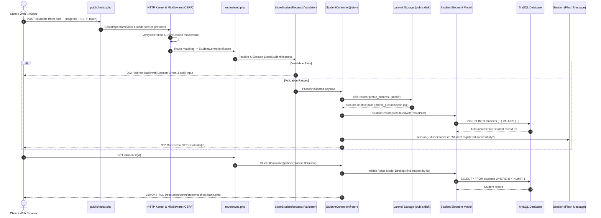

# Laravel Request Lifecycle in Student Registration

## Architectural Diagram

This diagram traces an incoming HTTP POST request for student registration from the browser through Laravel's core architecture to response delivery.

## Key Architectural Stages

1. **Entry Point (`public/index.php`)**: Accepts all web traffic, loads Composer autoloader, and retrieves the Laravel application instance from `bootstrap/app.php`.
2. **HTTP Middleware Pipeline**: Validates the CSRF token (`@csrf`), initializes session state, and checks incoming headers.
3. **Routing (`routes/web.php`)**: Matches `POST /students` to `StudentController@store`.
4. **Form Request Validation (`StoreStudentRequest`)**: Automatically injected before the controller action executes. Verifies required fields, unique constraints against MySQL, and image rules. If invalid, generates an immediate `ValidationException` redirecting with error bags.
5. **Secure Storage Handling (`Storage::disk('public')`)**: Laravel hashes the image name to prevent file collisions or directory traversal attacks, storing the binary under `storage/app/public/profile_pictures`.
6. **Eloquent ORM Persistence (`Student::create()`)**: Inserts the sanitized fields and file path into the MySQL `students` table.
7. **Flash Session & Redirect**: Flashes a success alert into session memory and redirects to the newly registered student's profile page.
