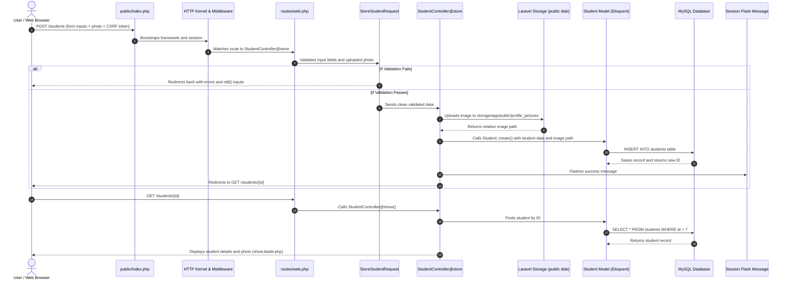

# Laravel Request Lifecycle in Student Registration

## Request Flow Diagram

This diagram shows how a form submission travels from the browser through Laravel to save a student record and display their profile.

## How It Works in Simple Steps:

1. **Form Submission**: The user fills in the registration form at `/students/create` and uploads a profile image. When clicking submit, the browser sends a `POST` request to `/students` along with the `@csrf` token for security.
2. **Middleware & Routing**: Laravel verifies the CSRF token and route matching in `routes/web.php`.
3. **Form Request Validation**: `StoreStudentRequest` checks that all required fields are filled, checks uniqueness of the Student ID and email in MySQL, and verifies that the uploaded file is a valid image under 2MB.
4. **File Storage**: The controller stores the photo in `storage/app/public/profile_pictures` and receives a relative path (e.g., `profile_pictures/abcdef1234.jpg`).
5. **Database Insert**: Eloquent ORM inserts the student record into MySQL.
6. **Session & Redirect**: A success flash message is saved in session, and the user is redirected to `/students/{id}` where the profile view renders their details and photo.
